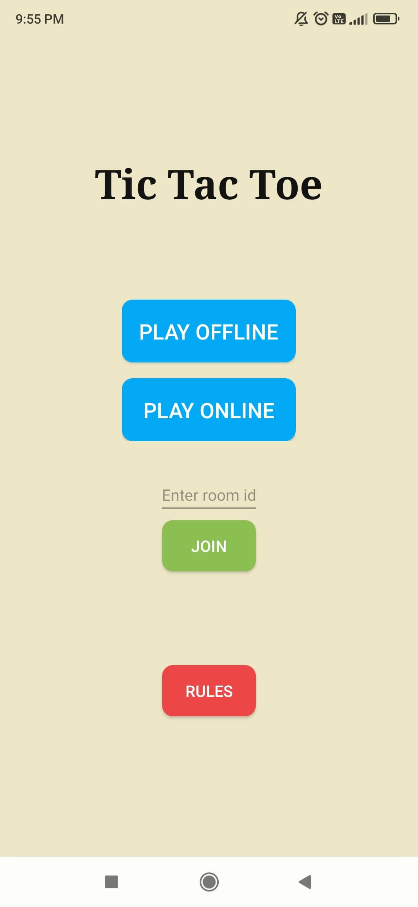
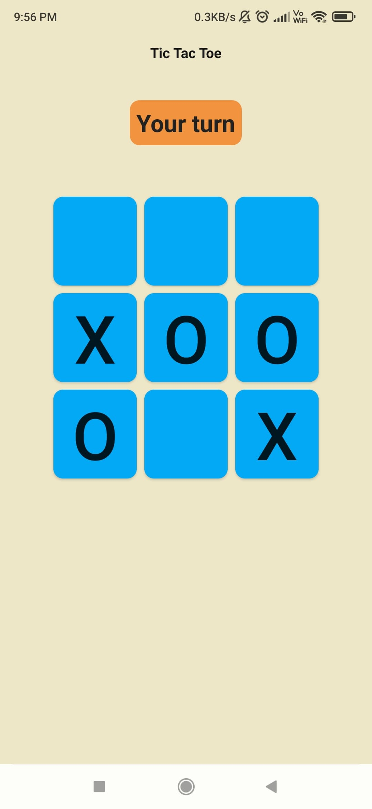
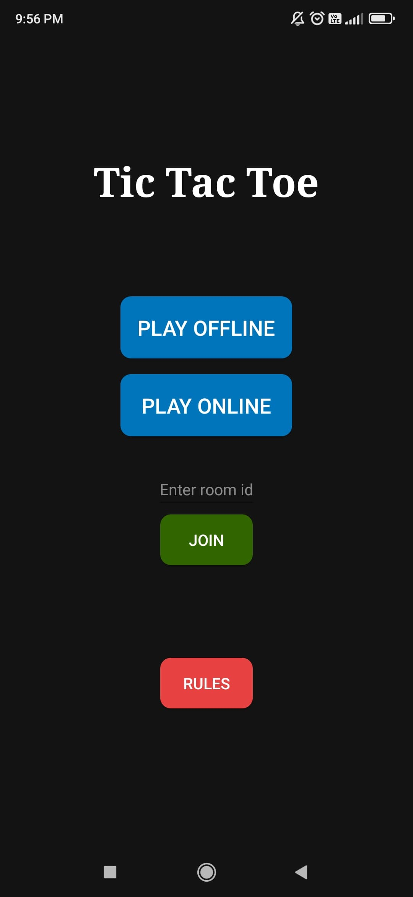
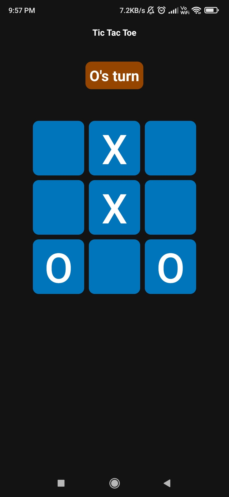

# Tic Tac Toe Twisted
A tic tac toe game developed in Android Studio using Kotlin and connected to firebase for online multiplayer access.

## Preview
<link rel="stylesheet" type="text/css" href="https://cdnjs.cloudflare.com/ajax/libs/fancybox/3.5.7/jquery.fancybox.min.css">

